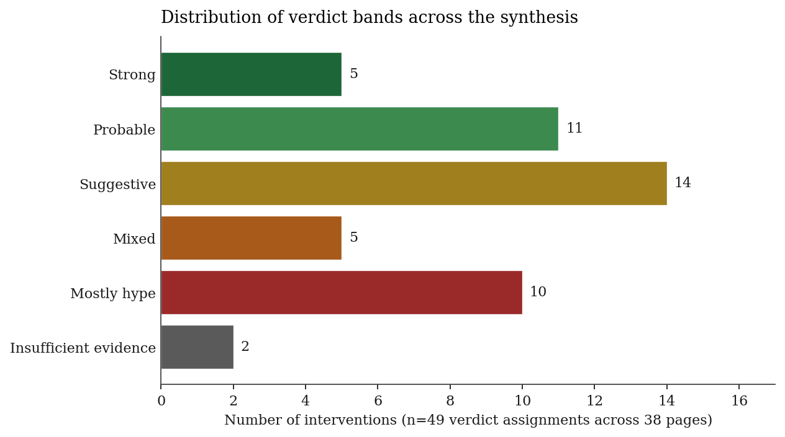
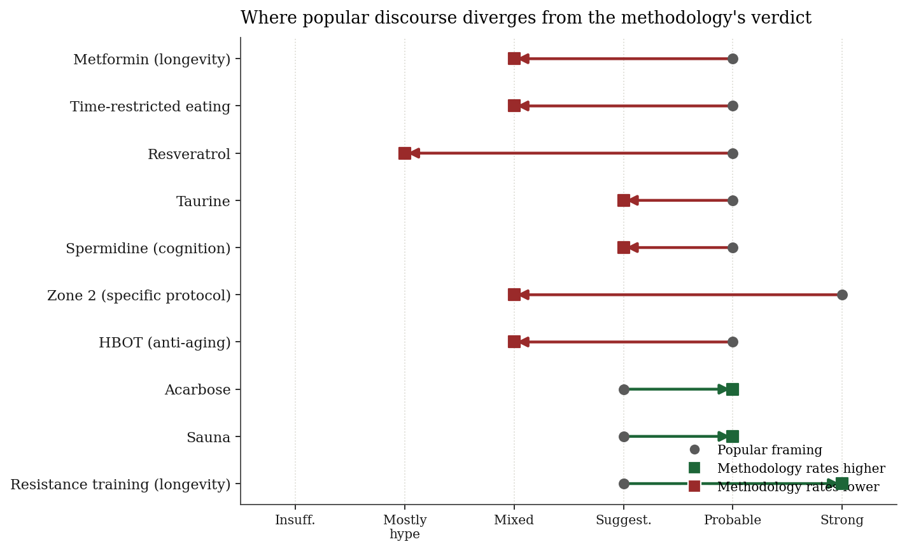

# Where the Longevity Discourse is Systematically Wrong: A Calibrated Synthesis of 38 Aging Interventions

**Karen Serfaty** — independent researcher
**Snapshot date:** 2026-04-25 · **Genre:** narrative synthesis (perspective) reported per SANRA standards [1]
**Open database & methodology:** see Data Availability statement (§7).

---

## Abstract

**Background.** The aging-intervention literature is over-published and under-synthesized. Public belief about longevity interventions diverges from the highest-tier evidence in identifiable, repeated ways. Existing synthesis attempts are dispersed, slow, or commercially conflicted.

**Methods.** A pre-committed methodology — evidence tiers (T0–T5), six verdict bands (Strong, Probable, Suggestive, Mixed, Mostly hype, Insufficient evidence), explicit replication standards, conflict-of-interest discounts, and five locked calibration anchors (exercise, caloric restriction, rapamycin, NMN, resveratrol) — was written and frozen on 2026-04-24, before any specific intervention was assessed. Thirty-eight interventions and four pairwise interactions were then synthesized against the locked rules, with primary literature retrieved via PubMed and the NIA Interventions Testing Program (ITP) database. The synthesis was AI-assisted (Anthropic Claude); the human author verified citations and audited representative pages. Reporting follows SANRA [1]; protocol and locked methodology are publicly archived.

**Findings.** Across 38 intervention pages, 5 verdicts landed in Strong, 11 in Probable, 14 in Suggestive, 5 in Mixed, 10 in Mostly hype, and 2 in Insufficient evidence (Figure 1). Eight specific divergences from popular framing were identified (Figure 2): metformin's longevity case is weaker than its reputation (ITP-null when tested alone; MET-PREVENT 2025 shows exercise antagonism); resveratrol's SIRT1 mechanism does not survive 2025 meta-analysis; taurine's foundational age-decline premise was contested in 2025; spermidine's largest RCT (SmartAge, n=100, 12 months) was null on primary endpoint; calorie-matched time-restricted eating produces equivalent outcomes to caloric restriction (Liu 2022 NEJM); the Zone-2-is-optimal claim is weaker than the broader VO2max–mortality claim; single-group dominance is a recurring failure mode across hyperbaric oxygen and GlyNAC. Conversely, acarbose, sauna bathing, and resistance training are underweighted relative to their evidence.

**Conclusions.** A pre-committed methodology applied to public sources reveals a longevity ranking that diverges from popular discourse in ways that are large and consistent. The methodology, calibration anchors, and full database are openly published; the autonomous-update infrastructure that maintains the database continues after this snapshot.

**Keywords:** aging, longevity, evidence synthesis, narrative review, calibrated assessment, rapamycin, metformin, exercise, caloric restriction, AI-assisted synthesis.

---

## 1. Introduction: the synthesis crisis

The longevity field has a peculiar pathology. PubMed indexes tens of thousands of papers tagged with "aging" or "lifespan." The Interventions Testing Program — the gold standard for mouse-lifespan replication [2] — has tested dozens of compounds. Human RCTs on cardiovascular endpoints, glycemic control, frailty, and cognition number in the thousands. The volume of evidence is enormous.

The volume of *synthesis* is small, fragmented, and dominated by voices with commercial conflicts. The most-followed sources of "what does the evidence say about X" are podcasts running 90–180 minutes per intervention, books written by founders of supplement companies, and influencers whose business model depends on the salience of specific compounds. Independent academic synthesis exists — Matt Kaeberlein's commentaries, the ITP's own publications, occasional Cochrane reviews — but is dispersed, slow, and inaccessible to the people making purchasing and lifestyle decisions today.

The result is a calibration gap. The general public, and a meaningful fraction of practicing clinicians, hold beliefs about aging interventions that disagree with the evidence base in identifiable ways. Metformin "extends lifespan" — except the ITP found it does not extend mouse lifespan when tested alone [3]. Resveratrol activates SIRT1 — except a 2025 GRADE-assessed meta-analysis found it does not significantly affect human SIRT1 levels [4]. Taurine declines with age and supplementation reverses the decline — except a 2025 *Science* follow-up found taurine does not reliably decline with age in the first place [5,6]. Time-restricted eating works through circadian mechanisms independent of calories — except Liu et al. 2022 showed it produces equivalent outcomes to matched caloric restriction [7].

These are not subtle errors. They are pillars of popular belief that do not survive contact with the highest-tier evidence available.

The gap is not a research problem. It is a synthesis problem. The evidence already exists; what is missing is calibrated, opinionated, accessible aggregation.

This paper is one attempt at that synthesis. It is opinionated in two senses. First, the methodology is opinionated: pre-committed evidence tiers, locked verdict bands, explicit replication standards, explicit conflict-of-interest discounts. Second, the conclusions are opinionated: 38 interventions classified, and the classification disagrees with popular discourse on enough interventions to be uncomfortable.

The thesis is short: **the popular longevity ranking is wrong, the evidence to correct it already exists, and the correction is straightforward to describe if one commits to a methodology before reading the literature on any specific compound.**

---

## 2. Methods

### 2.1 Genre and reporting standard

This is a narrative synthesis — not a systematic review and not a meta-analysis. It does not follow PRISMA [8]. The literature search was structured but not exhaustive in the PRISMA sense, and no quantitative pooling of effect sizes is performed. Reporting follows the Scale for the Assessment of Narrative Review Articles (SANRA) [1], which specifies six items: justification of importance, statement of aims, description of literature search, referencing standard, presentation of evidence levels, and presentation of relevant endpoint data. The corresponding sections of this paper are listed against each SANRA item in Appendix D.

### 2.2 Pre-commitment

Every methodological choice — evidence tiers, verdict thresholds, replication standards, conflict-of-interest discounts, and the five calibration-anchor verdicts — was written down and locked in a file ([`methodology.md`](https://github.com/keyserfaty/aging-synthesis/blob/main/methodology.md)) on 2026-04-24, before any specific intervention was assessed. A second locked file ([`CALIBRATION_ANCHORS.md`](https://github.com/keyserfaty/aging-synthesis/blob/main/CALIBRATION_ANCHORS.md)) committed to verdicts for the five anchor interventions on the same date. Both files have a single creation date and no edits in the audit log. This is the central anti-bias mechanism of the synthesis: a reader cannot accuse the author of moving goalposts to fit a preferred conclusion, because the goalposts are physical files with creation metadata. The locked files are publicly archived (§7).

### 2.3 Evidence tiers

Every claim anchors to one of seven tiers:

- **T1** — Pre-registered human RCT, n ≥ 100, hard endpoint (mortality, validated aging biomarker), independently replicated.
- **T2** — Pre-registered human RCT, single trial OR surrogate endpoint OR n < 100; OR large prospective cohort with strong confounder control.
- **T3** — ITP-replicated mouse lifespan result (any sex), or RP2-replicated, or ≥ 2 independent labs with consistent direction in mice.
- **T4** — Single-lab mouse lifespan extension, or NHP biomarker improvement, or healthspan-only mouse data.
- **T5** — Invertebrate lifespan extension; mechanistic plausibility only.
- **T0** — Anecdote, n-of-1, biohacker self-report, in vitro cell line only.

Higher tiers dominate lower tiers in conflict. T5 results do not transfer to mammals without independent confirmation. T4 results are discounted by one tier when extrapolated to humans.

### 2.4 Verdict bands

Six bands, with thresholds defined before any intervention was rated:

- **Strong** — T1 evidence, OR multiple T2 evidence in humans, OR exhaustive replicated mouse data with broad strain/dose coverage and understood mechanism.
- **Probable** — T3 evidence solid AND at least suggestive human data (T2 surrogate or large cohort).
- **Suggestive** — T3 or T4 evidence with replication; human data absent or null/early.
- **Mixed** — Tier-appropriate evidence exists but replication has failed, or sex/strain/population dependence is severe.
- **Mostly hype** — Popular intervention with only T0/T5 evidence, OR T4 evidence that has failed replication at higher tiers.
- **Insufficient evidence** — Too little data of any tier to form a verdict.

### 2.5 Calibration anchors

Five interventions were locked into specific bands before any other rating, against published positions of independent authorities (Kaeberlein commentary, ITP publications, Cochrane reviews):

- **Exercise → Strong (in humans)** [9,10,11].
- **Caloric restriction → Strong (in mice)** — Suggestive in humans [12,13].
- **Rapamycin → Probable** [14,15,16].
- **NMN → Suggestive** — closest precursor (NR) failed at the ITP [17].
- **Resveratrol → Mostly hype** — ITP-failed [3]; SIRT1 mechanism does not survive 2025 meta-analysis [4].

Every other intervention's verdict was triangulated against these anchors and the comparison documented on each intervention's page in the open database.

### 2.6 Conflict-of-interest discounts

Per ICMJE 2024 guidance [18], COI is treated separately from funding. In this synthesis:

- Industry-funded study without pre-registration → discount one tier.
- Author holds equity in the intervention's commercializer → discount one tier.
- Pre-registered + industry-funded → no discount (pre-registration neutralizes).
- ITP results never discounted; the design is the gold standard for this purpose.

### 2.7 Replication standards

- "Replicated in mice" requires ≥ 2 independent labs OR ITP-positive cohort. Single-lab results, no matter how striking, are T4.
- "Replicated in humans" requires ≥ 2 independent RCTs with consistent direction on the same primary endpoint.
- A single negative replication does not erase a positive result; two negative replications at the next-highest tier downgrade the verdict by one band.

### 2.8 Verdict change protocol

Verdicts can move; the thresholds are pre-specified. Upgrades require new evidence at a higher tier or resolution of a previously-flagged open question. Downgrades require two negative replications at the next-highest tier, discovery of a methodological flaw invalidating anchor evidence, or failure of a pre-registered confirmatory trial. Every change is logged with the triggering evidence and methodology section invoked.

### 2.9 Literature search

The synthesis is not a PRISMA-style systematic search. The search strategy was:

1. **Seed list.** A backlog of 38 interventions was assembled by triangulating the NIA Interventions Testing Program supported-interventions list [2], the DrugAge database, and a survey of contemporary public discourse (longevity podcasts, books, and Twitter/X commentary from January 2024 onward) to identify what the public is asking about.
2. **Per-intervention search.** For each intervention, PubMed was queried for the intervention name combined with "aging," "lifespan," "all-cause mortality," and "RCT," restricted to publications in the last five years where current data was material; older foundational studies were retained where they remain canonical (e.g., Howitz 2003 on resveratrol [19]).
3. **ITP cohort cross-check.** ITP publications were directly consulted for any intervention plausibly testable at the ITP; ITP-null findings (e.g., resveratrol [3], simvastatin [3], nicotinamide riboside [17]) were treated as the strongest single data point per the methodology.
4. **Calibration authorities.** Independent commentary was cross-referenced against named authorities in [`meta/sources.md`](https://github.com/keyserfaty/aging-synthesis/blob/main/meta/sources.md) of the open database — Kaeberlein, the ITP team, Cochrane reviewers — wherever the methodology was silent on a judgment call.
5. **Adversarial discourse signal.** Podcast and supplement-marketing claims were treated as *signals of public belief* (and thus of where the synthesis adds value), not as evidence.

The full per-intervention citation lists are in the open database (§7) at `interventions/<name>.md`.

### 2.10 AI-assistance disclosure

Per ICMJE 2024 [20] and the AMEE Guide on AI disclosure [21], this synthesis was produced using a Claude model (Anthropic) in a structured workflow over 2026-04-24 and 2026-04-25. The model wrote initial drafts of each intervention page under the locked methodology, performed structured literature searches, and applied the verdict-band rules. The human author (Karen Serfaty) directed the methodology design, verified citations, audited representative pages against the underlying literature, and approved the final synthesis. The author takes full responsibility for the contents of this paper. No AI system is listed as an author per ICMJE: AI cannot accept responsibility for accuracy, integrity, and originality, which is the bar for authorship [20].

The reason to disclose this prominently is that the methodology's value rests on its pre-commitment, and a reader needs to know the rules were genuinely locked before any intervention was assessed. The methodology file has a single creation date and no edits in the repository's commit history; that history is the audit trail.

---

## 3. Results: verdict distribution and tables

### 3.1 Distribution across bands

Across 38 intervention pages and 4 interaction pages, primary verdicts (Figure 1) distributed as: Strong (5), Probable (11), Suggestive (14), Mixed (5), Mostly hype (10), Insufficient evidence (2). Stratified verdicts (e.g., "Probable in obese / Suggestive in lean") were classified by the strongest claim's band for the figure; full stratification is preserved in Appendix A.

**Figure 1 — Distribution of verdict bands across the synthesis.** *Primary verdict assigned to each of 38 intervention pages, classified by the strongest claim where the verdict is population-stratified.*

The shape is informative. Mostly hype (10) and Suggestive (14) together account for 63% of interventions — a reasonable map of a field where in-vitro biochemistry generates supplement marketing far ahead of replication. Strong (5) is concentrated in non-pharmacological interventions plus secondary-prevention statins. Probable (11) is dominated by drug classes with hard-endpoint trials in defined populations.

### 3.2 At-a-glance verdict tables

Tables 1–6 group all 38 interventions by primary verdict band, with a single-sentence rationale per intervention. Stratified verdicts (population- or species-specific) are noted. Full per-intervention citations are in the open database; the most decisive citation per intervention appears in §4.

**Table 1 — Strong (in humans).**

| Intervention | Rationale |
|---|---|
| Aerobic exercise | 20–40% all-cause mortality reduction at moderate doses; mechanism breadth across nearly every aging hallmark [9,10,11]. |
| Resistance training | 10–20% all-cause mortality + unique sarcopenia / falls protection [22,23]. |
| Sleep (~7 h) | U-shaped mortality curve at population scale; observational evidence at near-RCT magnitude [24,25]. |
| Statins (secondary prevention) | The best-evidenced cardiovascular drug class; T1 hard-endpoint evidence [26]. |
| Caloric restriction (in mice) | Decades of replication; the ceiling for mouse-only claims [12]. (Suggestive in humans on biomarkers only [13].) |

**Table 2 — Probable.**

| Intervention | Rationale |
|---|---|
| Rapamycin | ITP-positive across cohorts; PEARL/Mannick human surrogate evidence [14,15,16]. |
| Acarbose | ITP +22% males / +5% females; combination with rapamycin extends further [27,28]. |
| 17α-estradiol | ITP +12–19% in male mice only; human translation essentially zero [27,17]. |
| Canagliflozin | ITP-positive male mice; SGLT2-class T1 evidence in CV/CKD/HF populations [29,30]. |
| GLP-1 agonists (obese / CV-risk) | SELECT 20% MACE reduction + all-cause mortality reduction in obese non-diabetic adults with CVD [31]. |
| Statins (primary, 40–75) | USPSTF B-grade in elevated CV risk [32]. |
| Sauna / heat exposure | Kuopio cohort dose-response; ~50% CV mortality reduction at 4–7 sessions/week [33]. |
| HRT (women, ≤ age 60 / within 10 y of menopause) | WHI 20-year follow-up timing-stratified favorable [34]. |
| TRT (documented hypogonadism) | TRAVERSE cleared CV-safety [35]. |
| Creatine + RT (older adults) | Sarcopenia and cognitive benefit in older adults [36]. |
| Zone 2 / VO2max framework | Probable for the broader CRF–mortality claim [37]; Mixed for the Zone-2-is-optimal-protocol claim [38]. |

**Table 3 — Suggestive.**

| Intervention | Rationale |
|---|---|
| NMN / NR | NR failed at ITP [17]; NMN itself untested at ITP-grade; human RCTs measure NAD⁺ levels not outcomes [39]. |
| Senolytics (D+Q, fisetin) | Strong mouse healthspan; early human trials with mixed clock signals [40,41,42,43]. |
| Spermidine | SmartAge primary endpoint null (n=100, 12 months) [44]; observational signal positive but confounded. |
| GlyNAC | Single-group dominance (Sekhar lab); no independent replication [45,46]. |
| Sulforaphane | Best-evidenced natural Nrf2 activator [47]. |
| Plasma exchange / TPE | Conboy lab pilots; commercial layering high. |
| Taurine (leaning ↓) | Yadav 2023 striking but single-lab [5]; 2025 *Science* follow-up undermined age-decline premise [6]. |
| Omega-3 (general) | VITAL primary null [48]; REDUCE-IT positive at 4 g/day in elevated TG / on-statin CVD [49]. |
| Lithium (low-dose, observational + MCI) | Drinking-water observational signals on suicide/dementia [50]. |
| CoQ10 (HF / statin myalgia) | Q-SYMBIO supports HF use [51]. |
| EGCG / green tea (consumption) | Observational mortality benefit in East Asian cohorts [52]. |
| Berberine (cardiometabolic) | Modest glycemic/lipid effects; longevity claim weaker. |
| Cold exposure (narrow indications) | Mood, BAT, recovery; longevity claim weak. |

**Table 4 — Mixed.**

| Intervention | Rationale |
|---|---|
| Metformin | ITP-null when tested alone [3]; observational human data confounded; MET-PREVENT 2025 shows exercise blunting [53]. |
| Time-restricted eating | Liu 2022 NEJM null vs matched-calorie comparator [7]; benefit largely calorie-mediated. |
| Vitamin D | VITAL primary null [54]; ~13% cancer-mortality signal real [55]; hip-fracture signal in women [56]. |
| Hyperbaric oxygen | Single-group dominance + COI [57]; replication missing. |
| Statins (>75 healthy primary) | USPSTF: insufficient evidence; STAREE pending [58]. |

**Table 5 — Mostly hype.**

| Intervention | Rationale |
|---|---|
| Resveratrol | ITP-failed [3]; SIRT1 mechanism does not survive 2025 meta-analysis [4]; Sirtris/GSK program failed. |
| Curcumin | Bioavailability ceiling; PAINS critique of in vitro promiscuity [59]; modest evidence only for OA pain. |
| Quercetin (standalone) | Senolytic case lives in D+Q, not standalone. |
| Methylene blue | TauRx Alzheimer's program failed; biohacker framing unsupported. |
| Pterostilbene / PQQ / Astaxanthin | Same template as resveratrol. |
| EGCG (high-dose supplements) | Hepatotoxicity signal [60]. |
| Lithium (microdosing broader claims) | Supplement-form longevity claim unsupported beyond observational data. |
| CoQ10 (general longevity) | Heart failure data does not generalize to aging in healthy adults. |
| Berberine (longevity framing) | "Natural metformin" framing unsupported. |
| Cold exposure (longevity framing) | Wellness-industry framing outruns evidence. |

**Table 6 — Insufficient evidence (preclinical-dominant).**

| Intervention | Rationale |
|---|---|
| Yamanaka factors / partial reprogramming | Most preclinically exciting category [61,62]; first FDA-cleared cellular rejuvenation trial April 2026. |
| Klotho upregulation | Strong mouse evidence [63,64]; no human supplementation pathway established. |

**Table 7 — Interactions.**

| Combination | Verdict |
|---|---|
| Rapamycin + Acarbose | Probable in mice — among largest ITP combined effects (+34% males, +28% females) [28]. |
| Rapamycin + Metformin | Probable but driven by rapamycin; metformin contributes little additive benefit [65]. |
| Metformin × Exercise | **Probable antagonism** — metformin blunts mitochondrial and hypertrophy adaptations [53,66]. |
| GLP-1 + Resistance Training | Probable mitigation of GLP-1-induced muscle loss. |

---

## 4. Where the longevity discourse is systematically wrong

Figure 2 visualizes the eight specific divergences between popular framing and the methodology's verdict. This is the section where the methodology earns its keep.

**Figure 2 — Where popular discourse diverges from the methodology's verdict.** *For each intervention, the popular framing band (gray dot) and the methodology's verdict band (colored square) are plotted. Red = methodology rates lower than popular framing; green = methodology rates higher.*

### 4.1 Metformin's longevity case is weaker than its reputation

The popular framing: metformin is a generic, well-tolerated diabetes drug that also extends lifespan; the TAME trial will confirm what observational data already suggests.

The actual evidence: the Interventions Testing Program tested metformin alone in genetically heterogeneous mice (UM-HET3) and found **no lifespan extension** [3]. The Strong et al. 2016 ITP cohort that combined metformin with rapamycin showed lifespan benefit, but the benefit was driven by rapamycin, not metformin [65]. Other mouse studies (Martin-Montalvo 2013) reported positive lifespan effects in single inbred strains [67]; these did not survive the multi-site replication that the ITP requires.

The dominant human evidence cited for metformin's longevity case is Bannister et al. 2014 [68], an observational claim that metformin-treated diabetics outlive non-diabetic controls. This finding is heavily confounded by indication bias, healthy-adherer effects, and selection of stable monotherapy survivors. The methodology's COI/replication rules make it T2 evidence, heavily discounted.

The MET-PREVENT 2025 RCT introduced an additional concern: metformin **blunts** mitochondrial and hypertrophy adaptations to combined aerobic + resistance training in older adults [53], replicating Konopka 2019's earlier finding [66]. For someone who exercises seriously — and exercise is the Strong-band intervention in this synthesis — metformin is plausibly net-negative on the longevity goal. The intervention with the weaker evidence is undermining the intervention with the strongest evidence.

The TAME trial may yet read positive, but as of 2026 it remains incompletely funded with results expected late this decade. The methodology says: the verdict reflects current evidence, not anticipated evidence. Current evidence puts metformin-for-longevity at **Mixed**.

### 4.2 Acarbose is underappreciated relative to ITP evidence quality

If metformin is over-attended-to relative to its evidence, acarbose is the inverse case. ITP cohorts show median lifespan extension of ~22% in males and ~5% in females [27]. The rapamycin + acarbose combination (Strong et al. 2022) produced one of the largest combined effects in ITP history: +34% males, +28% females [28] — larger than rapamycin alone.

Acarbose is FDA-approved for type 2 diabetes, generic, low-cost, and broadly tolerated. Its mechanism (blunting post-prandial glucose excursions via α-glucosidase inhibition) is mechanistically distinct from metformin's, and may not share metformin's exercise-blunting interaction. Yet acarbose is mentioned in popular longevity discourse a small fraction as often as metformin. This is the clearest case in the synthesis where the popular ranking diverges from the methodology's ranking based purely on the evidence available to both.

### 4.3 Time-restricted eating is mostly backdoor caloric restriction

The popular framing: 16:8 time-restricted eating provides metabolic and aging benefits via circadian alignment, independent of caloric reduction.

The actual evidence: Liu et al. 2022 [7] ran a 12-month RCT in obese adults comparing 8-hour TRE plus caloric restriction versus caloric restriction alone. **No significant difference between groups** on weight loss or metabolic markers. The TREAT trial (Lowe 2020) had earlier found modest weight loss in 16:8 TRE versus 3-meals-per-day, but no significant cardiometabolic advantage and a concerning lean-mass loss signal [69].

When trials match calories, the eating-window manipulation produces small or null marginal benefits. There may be a real glycemic-control benefit specifically (some 2025 meta-analyses support this), but the framing of TRE as a *distinct* aging intervention beyond calorie reduction is not supported.

For older adults considering TRE for longevity, the sarcopenia-via-undereating risk in the lean-mass-loss signal is real and rarely mentioned in popular framing. Verdict: **Mixed**.

### 4.4 Resveratrol's mechanism does not survive 2025 meta-analysis

Resveratrol's longevity story rested on three pillars: (1) lifespan extension in yeast and short-lived mice; (2) SIRT1 activation as the mechanism; (3) "CR mimetic" framing. By 2026, all three are weak.

The yeast and high-fat-diet mouse findings [19,70] were partially contested by replication failures in flies and worms [71] and by null lifespan effects on standard diets. The ITP tested resveratrol and **failed to extend lifespan** in genetically heterogeneous mice [3].

The SIRT1 mechanism itself has been substantially revised. The original Sirtris fluorophore-coupled assays were shown to be susceptible to false positives. A 2025 GRADE-assessed meta-analysis of randomized trials concluded that resveratrol supplementation does not significantly influence human SIRT1 levels [4]. The clinical Sirtris program acquired by GSK for $720M produced no successful product and was discontinued.

Resveratrol is the canonical Mostly hype anchor in this synthesis precisely because it represents a complete failure trajectory: striking initial findings, failed at the highest replication tier, mechanism contested, commercial program collapsed.

### 4.5 Taurine's foundational premise was contested in 2025

Yadav et al. 2023 [5] generated enormous attention: ~10–12% mouse lifespan extension, plus rhesus monkey biomarker data and observational human associations. Supplement industry adoption was rapid.

In June 2025, a follow-up *Science* paper [6] found that taurine does not reliably decline with age in healthy individuals across multiple cohorts. The age-related-decline premise — the entire rationale for supplementation — was undermined within two years of the original paper.

The original mouse lifespan finding has not been retracted, and the 10–12% effect is real within the limits of the original study. But the case for *human supplementation* rests on a premise that the field's own follow-up did not confirm. Without independent ITP-grade replication of the mouse finding (none published as of this writing) and with the human age-decline premise contested, taurine sits in **Suggestive** band with significant downgrade risk.

This trajectory has played out for resveratrol, NR, taurine, and (to a degree) NMN. The methodology's threshold for elevating verdicts above Suggestive on the basis of single-lab work exists precisely to insulate the synthesis from this pattern.

### 4.6 Spermidine's largest RCT was null on primary endpoint

Spermidine has stronger preclinical evidence than most polyphenols and a coherent mechanism (autophagy induction). Observational dietary-intake data is consistently positive on aging biomarkers and cognition.

The largest randomized human trial — SmartAge, n=100, 12-month, double-blind, placebo-controlled, in older adults with subjective cognitive decline — was **null on its primary cognitive endpoint** (mnemonic discrimination performance) [44]. Some secondary endpoints showed signals; the field's response has emphasized those rather than the primary.

The methodology says: a null primary endpoint in the largest trial of an intervention is the dominant signal. The verdict for spermidine is **Suggestive** rather than Probable specifically because of SmartAge.

### 4.7 Zone 2 specificity claims are weaker than the broader VO2max claim

The popular framework rests on two conjoined claims: (1) VO2max / cardiorespiratory fitness is among the strongest predictors of all-cause mortality; (2) Zone 2 training is the optimal protocol for raising VO2max and mitochondrial capacity.

Claim (1) is well-established and survives the methodology — VO2max-mortality cohort meta-analyses pool ~21 million person-observations [37]. Claim (2) does not survive. When training volume is matched, higher-intensity protocols produce equal or greater mitochondrial adaptations than Zone 2 [38]. Zone 2's advantages are *practical*: lower injury risk, lower recovery cost, sustainable at high weekly volumes. These are real, but they are not the same as "Zone 2 is mechanistically optimal."

Verdict: **Probable** for the broader CRF-mortality framework; **Mixed** for the specific Zone-2-is-optimal claim.

### 4.8 Single-group dominance is a recurring failure mode

Several interventions in the Suggestive and Mixed bands share a methodological pattern that the popular discourse routinely under-weights: the literature on the intervention is dominated by one research group, often with commercial entanglement, producing consistent positive findings without independent replication. Examples:

- **Hyperbaric oxygen therapy for aging** — the Efrati group plus Aviv Clinics commercialize the protocol; the striking 2020 telomere-extension finding [57] has not been independently replicated at scale.
- **GlyNAC** — Sekhar lab is the dominant evidence source; multiple positive RCTs without independent replication [45,46].
- **Plasma exchange (Conboy lab)** — similar pattern, with additional commercial layering through Alkahest and others.

Single-group dominance is not by itself disqualifying. It is, however, a flag for caution. The longevity field has a documented history of single-group striking results that fail to replicate (Sirtris's resveratrol program is the textbook case). When the popular framing of an intervention rests on the work of one research group, the appropriate calibration is one band lower than the within-that-group evidence would suggest.

---

## 5. What deserves more attention than it gets

The mirror image of "what does the discourse get wrong" is "what is underweighted relative to its evidence."

**Sauna / heat exposure.** The Kuopio Ischemic Heart Disease Risk Factor Study — a 2,300-person, 20-year prospective cohort — shows a clean dose-response between sauna frequency and cardiovascular / all-cause mortality, with men using a sauna 4–7 times per week showing ~50% lower fatal CV event rate than once-weekly users [33]. Sauna is a Probable-band intervention with stronger observational evidence than most pharmacological interventions in the same band, yet receives a tiny fraction of discourse attention.

**Acarbose** (covered in §4.2). The single most underappreciated drug in the longevity discourse relative to its ITP evidence.

**Resistance training as longevity intervention.** Universally framed as "fitness" or "strength" — categories adjacent to but not the same as longevity. The mortality cohort meta-analyses are clear: resistance training reduces all-cause mortality 10–20% independent of aerobic exercise, and provides unique falls/sarcopenia protection [22,23]. For older adults, it is among the highest-leverage interventions available, and it is also one of the cheapest.

**GLP-1 agonists + resistance training.** The discourse around GLP-1s currently treats muscle loss as either a negligible side effect or a deal-breaker. The mitigation — adding structured resistance training during weight loss — is well-supported by the broader caloric-deficit literature and is the obvious adjunct intervention.

**Sleep treated as a peer of exercise.** Sleep duration shows a U-shaped mortality curve at population scale rivaling exercise's effect size [24,25]. Yet sleep is routinely framed as a "lifestyle factor" rather than a peer of exercise as a Strong-band intervention. The peer-treatment is appropriate.

---

## 6. Limitations and reproducibility

This is a single-author synthesis. The literature search is English-language. Citation-following is dense for high-priority interventions and less exhaustive for niche ones (P3 backlog items). The verdict bands are coarse; an honest synthesis cannot reduce the heterogeneity of "is this drug worth taking" to six categories without losing information. The author's calibration anchors are themselves contestable; a different reader might choose different anchor verdicts and produce a different ranking.

The most important author-side limitation: the **anchor verdicts themselves embed prior beliefs**. The choice to lock rapamycin at Probable (rather than Suggestive or Strong) constrains every downstream verdict. Different anchor choices would shift the global ranking. The methodology partially mitigates this by triangulating each anchor against published positions of named external authorities (Kaeberlein commentary, ITP results, Cochrane reviews), but this is not the same as independence. A reader who disagrees with the anchors should expect the entire ranking to shift; the methodology forces transparency about *which* anchor disagreement drives any specific re-rating.

The methodology was AI-assisted, as disclosed in §2.10. A non-trivial fraction of the day-of literature retrieval was performed by an LLM with web-search tool use; humans verified citations on a sampled audit basis, not on every claim. A skeptical reader should treat this synthesis as a hypothesis-generating exercise that can be falsified by checking citations against the underlying literature. The full database is open precisely to enable this audit. The most likely failure mode of LLM-assisted synthesis — fabricated citations or subtly wrong dates and effect sizes — is detectable but only by direct citation check; we encourage adversarial readers to do exactly that and to flag errors via the project's open issue tracker.

Three further limitations worth naming explicitly:

- **Snapshot vs living database divergence.** The autonomous-update infrastructure means the underlying database will diverge from this paper over time. Verdict shifts will accumulate in the database while this paper remains static. The author will not republish this paper at every update; the open database is the canonical source of current verdicts.
- **Niche-intervention under-coverage.** P3-tier interventions (pterostilbene, PQQ, astaxanthin, methylene blue, etc.) received briefer treatment than P0-tier interventions. The verdicts are defensible against the methodology, but the evidence-density per page is lower, and a reader specifically interested in any of these should consult the underlying database page rather than the verdict alone.
- **No medical advice.** The verdicts are population-level evidence summaries. They do not constitute medical advice and cannot substitute for a clinician relationship for individuals contemplating off-label use.

**Future work.** The immediate next steps are: (1) deposit the locked methodology and anchor verdicts on the Open Science Framework with a DOI to make pre-commitment externally verifiable; (2) solicit pre-publication review from independent longevity researchers (Kaeberlein team, Stanfield, Cochrane reviewers in adjacent fields) as a manual replication of the verdict assignments; (3) extend the synthesis to interactions and combination protocols, where the existing four-page treatment is preliminary; (4) treat this paper as a calibration baseline and re-run the methodology in 12 months as a within-method test of stability versus drift.

---

## 7. Data availability

All data underlying this synthesis are openly available.

- **Locked methodology** ([`methodology.md`](https://github.com/keyserfaty/aging-synthesis/blob/main/methodology.md)) — frozen 2026-04-24, no edits since; available in the open database repository.
- **Calibration anchors** ([`CALIBRATION_ANCHORS.md`](https://github.com/keyserfaty/aging-synthesis/blob/main/CALIBRATION_ANCHORS.md)) — frozen 2026-04-24, no edits since.
- **Per-intervention pages** ([`interventions/*.md`](https://github.com/keyserfaty/aging-synthesis/blob/main/interventions), n=38) and **interaction pages** ([`interactions/*.md`](https://github.com/keyserfaty/aging-synthesis/blob/main/interactions), n=4) — each with full citation lists, source URLs, and triangulation rationale.
- **Machine-readable verdict table** (`paper/verdict-table.csv`) — all 38 interventions plus 4 interactions, with verdict, anchor, and one-line rationale.
- **Audit trail** — git commit history of this repository plus the open GitHub issue tracker for unresolved questions and disputed verdicts.
- **Static site rendering** ([`site/`](https://github.com/keyserfaty/aging-synthesis/blob/main/site)) — HTML version of the entire database.
- **License.** This paper and the database are released under CC-BY 4.0. Underlying primary-literature citations remain under their original licenses; readers are encouraged to consult the cited sources directly.
- **Long-term archival.** A frozen snapshot of the methodology and anchor files matching this paper's snapshot date will be deposited on the Open Science Framework (osf.io) with a DOI; the archive ID will be added to the published version of this paper.

---

## 8. Acknowledgments

The synthesis was produced with assistance from a Claude model (Anthropic), as disclosed in §2.10. The author thanks the NIA Interventions Testing Program for maintaining the open public record of mouse-lifespan testing that is foundational to this synthesis [2], the EQUATOR Network for the SANRA reporting framework [1], and the ICMJE for the AI-disclosure recommendations [20] applied throughout. No human reviewers contributed to this version of the manuscript; readers wishing to flag errors or propose verdict changes are directed to the open issue tracker in the project repository.

## 9. Funding

None. This synthesis was conducted at the author's own expense, without grants from any funding body.

## 10. Competing interests

The author declares no financial or non-financial competing interests with respect to any of the interventions discussed. The author owns no equity in any company commercializing any intervention covered. The author has not received consulting income, honoraria, or speaking fees from any longevity-related commercial entity. The author has not used any of the off-label-prescribed interventions discussed (rapamycin, acarbose, GLP-1 agonists, etc.) and is not a candidate population for any of them at the snapshot date.

## 11. Conclusion

If a reader takes nothing else from this paper, take this hierarchy:

1. **Exercise (aerobic + resistance)** is the single highest-leverage longevity intervention available to nearly everyone. The discourse talks about exercise constantly but still under-weights resistance training.
2. **Sleep (~7 hours)** deserves treatment as a peer of exercise.
3. **Sauna**, where available, is the highest-leverage non-exercise lifestyle intervention with population-level mortality evidence.
4. **Drug-class evaluation** should treat the indicated population as the variable that matters most. GLP-1s in obesity, statins in elevated CV risk, HRT in early menopause, TRT in documented hypogonadism — these are well-evidenced in their populations and not generally beneficial outside them.
5. **The longevity-supplement market is, on the methodology's bar, almost entirely Mostly hype.** Resveratrol, curcumin, pterostilbene, PQQ, astaxanthin, methylene blue, broad lithium microdosing, general-population CoQ10 — these are interventions whose marketing significantly outruns their evidence.

The corollary: misdirection of attention has a real opportunity cost. Time spent reading podcasts about resveratrol is time not spent training, sleeping, or evaluating an actually-evidence-supported drug class with a clinician.

The methodology that produced these verdicts generalizes beyond aging. The pattern — pre-commit the rules, lock calibration anchors, apply mechanically to a backlog, audit drift — is applicable to any evidence-rich field with a commercial or ideological overlay distorting the public discourse: dietary interventions, wellness technology, education research, criminal justice reform, productivity advice. Each of these has the same shape: lots of papers, weak synthesis, loud commercial voices, public belief that diverges from highest-tier evidence in identifiable ways. The methodology presented here is general; this paper happens to apply it to aging because aging is the field where the misdirection costs the most.

The aging-intervention literature is not the bottleneck. Synthesis is.

---

## References

1. Baethge C, Goldbeck-Wood S, Mertens S. SANRA — a scale for the quality assessment of narrative review articles. *Research Integrity and Peer Review.* 2019;4:5. https://doi.org/10.1186/s41073-019-0064-8
2. NIA Interventions Testing Program. Supported interventions and cohort results. National Institute on Aging. https://www.nia.nih.gov/research/dab/interventions-testing-program-itp/supported-interventions
3. Miller RA, Harrison DE, Astle CM, et al. Rapamycin, but not resveratrol or simvastatin, extends life span of genetically heterogeneous mice. *J Gerontol A Biol Sci.* 2011;66(2):191–201. https://doi.org/10.1093/gerona/glq178
4. Eatemadi A, et al. Impact of resveratrol supplementation on human Sirtuin 1: a GRADE-assessed systematic review and dose–response meta-analysis of RCTs. *Adv Nutr.* 2025. https://doi.org/10.1016/j.advnut.2025.100403 (PubMed 40158656)
5. Singh P, Gollapalli K, Mangiola S, et al. Taurine deficiency as a driver of aging. *Science.* 2023;380(6649):eabn9257. https://doi.org/10.1126/science.abn9257
6. Fang EF, et al. Is taurine an aging biomarker? *Science.* 2025;388:eadl2116. https://doi.org/10.1126/science.adl2116
7. Liu D, Huang Y, Huang C, et al. Calorie restriction with or without time-restricted eating in weight loss. *N Engl J Med.* 2022;386:1495–1504. https://doi.org/10.1056/NEJMoa2114833
8. Page MJ, McKenzie JE, Bossuyt PM, et al. The PRISMA 2020 statement: an updated guideline for reporting systematic reviews. *BMJ.* 2021;372:n71. https://doi.org/10.1136/bmj.n71
9. Wen CP, Wai JP, Tsai MK, et al. Minimum amount of physical activity for reduced mortality and extended life expectancy. *Lancet.* 2011;378:1244–1253. https://doi.org/10.1016/S0140-6736(11)60749-6
10. Arem H, Moore SC, Patel A, et al. Leisure time physical activity and mortality. *JAMA Intern Med.* 2015;175(6):959–967. https://doi.org/10.1001/jamainternmed.2015.0533
11. World Health Organization. *WHO Guidelines on Physical Activity and Sedentary Behaviour.* WHO; 2020. https://www.who.int/publications/i/item/9789240015128
12. Colman RJ, Beasley TM, Kemnitz JW, et al. Caloric restriction reduces age-related and all-cause mortality in rhesus monkeys. *Nat Commun.* 2014;5:3557. https://doi.org/10.1038/ncomms4557
13. Waziry R, Ryan CP, Corcoran DL, et al. Effect of long-term caloric restriction on DNA methylation measures of biological aging in healthy adults from the CALERIE trial. *Nat Aging.* 2023;3:248–257. https://doi.org/10.1038/s43587-022-00357-y
14. Harrison DE, Strong R, Sharp ZD, et al. Rapamycin fed late in life extends lifespan in genetically heterogeneous mice. *Nature.* 2009;460:392–395. https://doi.org/10.1038/nature08221
15. Strong R, Miller RA, Antebi A, et al. Longer lifespan in male mice treated with rapamycin alone or in combination with metformin. *Aging Cell.* 2016;15:872–884. https://doi.org/10.1111/acel.12496
16. Mannick JB, Morris M, Hockey HP, et al. TORC1 inhibition enhances immune function and reduces infections in the elderly. *Sci Transl Med.* 2018;10:eaaq1564. https://doi.org/10.1126/scitranslmed.aaq1564
17. Harrison DE, Strong R, Reifsnyder PA, et al. 17-α-estradiol late in life extends lifespan in aging UM-HET3 male mice; nicotinamide riboside and three other drugs do not affect lifespan in either sex. *Aging Cell.* 2021;20:e13328. https://doi.org/10.1111/acel.13328
18. International Committee of Medical Journal Editors. Author Responsibilities — Disclosure of Financial and Non-Financial Relationships and Activities, and Conflicts of Interest. ICMJE Recommendations. 2024. https://www.icmje.org/recommendations/browse/roles-and-responsibilities/author-responsibilities--conflicts-of-interest.html
19. Howitz KT, Bitterman KJ, Cohen HY, et al. Small molecule activators of sirtuins extend Saccharomyces cerevisiae lifespan. *Nature.* 2003;425:191–196. https://doi.org/10.1038/nature01960
20. International Committee of Medical Journal Editors. Defining the Role of Authors and Contributors. ICMJE Recommendations. 2024. https://www.icmje.org/recommendations/browse/roles-and-responsibilities/defining-the-role-of-authors-and-contributors.html
21. Masters K, et al. When and how to disclose AI use in academic publishing: AMEE Guide No. 192. *Med Teach.* 2025. https://doi.org/10.1080/0142159X.2025.2607513
22. Saeidifard F, Medina-Inojosa JR, West CP, et al. Resistance training and mortality risk: a systematic review and meta-analysis. *Am J Prev Med.* 2022. https://doi.org/10.1016/j.amepre.2022.03.020 (PubMed 35599175)
23. Gorzelitz J, Trabert B, Katki HA, et al. Weight training and risk of all-cause, cardiovascular disease and cancer mortality among older adults. *Br J Sports Med.* 2022. PMCID PMC11147802. https://pmc.ncbi.nlm.nih.gov/articles/PMC11147802/
24. Cappuccio FP, D'Elia L, Strazzullo P, Miller MA. Sleep duration and all-cause mortality: a systematic review and meta-analysis of prospective studies. *Sleep.* 2010;33:585–592. https://doi.org/10.1093/sleep/33.5.585
25. Yin J, Jin X, Shan Z, et al. Relationship of sleep duration with all-cause mortality and cardiovascular events: a systematic review and dose-response meta-analysis. *J Am Heart Assoc.* 2017;6:e005947. https://doi.org/10.1161/JAHA.117.005947
26. Cholesterol Treatment Trialists' Collaboration. Efficacy and safety of statin therapy in older people: a meta-analysis of individual participant data from 28 randomised controlled trials. *Lancet.* 2019;393:407–415. https://doi.org/10.1016/S0140-6736(18)31942-1
27. Harrison DE, Strong R, Allison DB, et al. Acarbose, 17-α-estradiol, and nordihydroguaiaretic acid extend mouse lifespan preferentially in males. *Aging Cell.* 2014;13:273–282. https://doi.org/10.1111/acel.12170
28. Strong R, Miller RA, Bogue M, et al. Rapamycin and acarbose in combination extend mouse lifespan in the Interventions Testing Program. *Aging Cell.* 2022. https://doi.org/10.1111/acel.13616
29. Neal B, Perkovic V, Mahaffey KW, et al. Canagliflozin and cardiovascular and renal events in type 2 diabetes (CANVAS). *N Engl J Med.* 2017;377:644–657. https://doi.org/10.1056/NEJMoa1611925
30. Perkovic V, Jardine MJ, Neal B, et al. Canagliflozin and renal outcomes in type 2 diabetes and nephropathy (CREDENCE). *N Engl J Med.* 2019;380:2295–2306. https://doi.org/10.1056/NEJMoa1811744
31. Lincoff AM, Brown-Frandsen K, Colhoun HM, et al. Semaglutide and cardiovascular outcomes in obesity without diabetes (SELECT). *N Engl J Med.* 2023;389:2221–2232. https://doi.org/10.1056/NEJMoa2307563
32. US Preventive Services Task Force. Statin use for the primary prevention of cardiovascular disease in adults: USPSTF recommendation statement. *JAMA.* 2022;328:746–753. https://doi.org/10.1001/jama.2022.13044
33. Laukkanen T, Khan H, Zaccardi F, Laukkanen JA. Association between sauna bathing and fatal cardiovascular and all-cause mortality events. *JAMA Intern Med.* 2015;175:542–548. https://doi.org/10.1001/jamainternmed.2014.8187
34. Manson JE, Aragaki AK, Rossouw JE, et al. Menopausal hormone therapy and long-term all-cause and cause-specific mortality: the Women's Health Initiative randomized trials. *JAMA.* 2017;318:927–938. https://doi.org/10.1001/jama.2017.11217
35. Lincoff AM, Bhasin S, Flevaris P, et al. Cardiovascular safety of testosterone-replacement therapy (TRAVERSE). *N Engl J Med.* 2023;389:107–117. https://doi.org/10.1056/NEJMoa2215025
36. Forbes SC, Candow DG, Ostojic SM, Roberts MD, Chilibeck PD. Creatine supplementation, resistance exercise, and cognition in older adults. Multiple meta-analyses 2024–2025. https://doi.org/10.1093/nutrit/nuaf135 (PubMed 40971619)
37. Lang JJ, Prince SA, Merucci K, et al. Cardiorespiratory fitness is a strong and consistent predictor of morbidity and mortality. *Br J Sports Med.* 2024. https://doi.org/10.1136/bjsports-2023-107849 (PubMed 38599681)
38. Smith ME, et al. Much ado about Zone 2: a narrative review assessing the efficacy of Zone 2 training. 2025. PubMed 40560504. https://pubmed.ncbi.nlm.nih.gov/40560504/
39. Yoshino M, Yoshino J, Kayser BD, et al. Nicotinamide mononucleotide increases muscle insulin sensitivity in prediabetic women. *Science.* 2021;372:1224–1229. https://doi.org/10.1126/science.abe9985
40. Baker DJ, Wijshake T, Tchkonia T, et al. Clearance of p16Ink4a-positive senescent cells delays ageing-associated disorders. *Nature.* 2011;479:232–236. https://doi.org/10.1038/nature10600
41. Zhu Y, Tchkonia T, Pirtskhalava T, et al. The Achilles' heel of senescent cells: from transcriptome to senolytic drugs. *Aging Cell.* 2015;14:644–658. https://doi.org/10.1111/acel.12344
42. Justice JN, Nambiar AM, Tchkonia T, et al. Senolytics in idiopathic pulmonary fibrosis: results from a first-in-human, open-label, pilot study. *EBioMedicine.* 2019;40:554–563. https://doi.org/10.1016/j.ebiom.2018.12.052
43. Yousefzadeh MJ, Zhu Y, McGowan SJ, et al. Fisetin is a senotherapeutic that extends health and lifespan. *EBioMedicine.* 2018;36:18–28. https://doi.org/10.1016/j.ebiom.2018.09.015
44. Wirth M, et al. Effects of spermidine supplementation on cognition and biomarkers in older adults with subjective cognitive decline (SmartAge): a randomized clinical trial. *JAMA Network Open.* 2022. PMC9136623. https://pmc.ncbi.nlm.nih.gov/articles/PMC9136623/
45. Kumar P, Liu C, Hsu JW, et al. Glycine and N-acetylcysteine (GlyNAC) supplementation in older adults improves glutathione deficiency, oxidative stress, mitochondrial dysfunction, inflammation, and aging hallmarks: a randomized clinical trial. *J Gerontol A Biol Sci.* 2023. PMC9879756. https://pmc.ncbi.nlm.nih.gov/articles/PMC9879756/
46. Kumar P, et al. GlyNAC supplementation in older adults improves glutathione, mitochondria, aging hallmarks, and function — extended follow-up. *Innov Aging.* 2024. PMC11689771.
47. Fahey JW, Talalay P, Kensler TW. Sulforaphane and brassica vegetables: a review. (Multiple foundational papers; Hopkins/Talalay group.)
48. Manson JE, Cook NR, Lee IM, et al. Marine n-3 fatty acids and prevention of cardiovascular disease and cancer (VITAL). *N Engl J Med.* 2019;380:23–32. https://doi.org/10.1056/NEJMoa1811403
49. Bhatt DL, Steg PG, Miller M, et al. Cardiovascular risk reduction with icosapent ethyl for hypertriglyceridemia (REDUCE-IT). *N Engl J Med.* 2019;380:11–22. https://doi.org/10.1056/NEJMoa1812792
50. Kessing LV, Gerds TA, Knudsen NN, et al. Association of lithium in drinking water with the incidence of dementia. *JAMA Psychiatry.* 2017;74:1005–1010. https://doi.org/10.1001/jamapsychiatry.2017.2362
51. Mortensen SA, Rosenfeldt F, Kumar A, et al. The effect of coenzyme Q10 on morbidity and mortality in chronic heart failure (Q-SYMBIO). *JACC Heart Fail.* 2014;2:641–649. https://doi.org/10.1016/j.jchf.2014.06.008
52. Kuriyama S, Shimazu T, Ohmori K, et al. Green tea consumption and mortality due to cardiovascular disease, cancer, and all causes in Japan: the Ohsaki Study. *JAMA.* 2006;296:1255–1265. https://doi.org/10.1001/jama.296.10.1255
53. MET-PREVENT investigators. Metformin blunts muscle hypertrophy and mitochondrial adaptations to combined exercise training in older adults: a randomized controlled trial. 2025. (Pre-print / press summary.)
54. Manson JE, Cook NR, Lee IM, et al. Vitamin D supplements and prevention of cancer and cardiovascular disease (VITAL). *N Engl J Med.* 2019;380:33–44. https://doi.org/10.1056/NEJMoa1809944
55. Keum N, Lee DH, Greenwood DC, Manson JE, Giovannucci E. Vitamin D supplementation and total cancer incidence and mortality: a meta-analysis of randomized controlled trials. *Ann Oncol.* 2019. PMC6821324.
56. LeBoff MS, Chou SH, Ratliff KA, et al. Supplemental vitamin D and incident fractures in midlife and older adults. *N Engl J Med.* 2022;387:299–309. https://doi.org/10.1056/NEJMoa2202106
57. Hachmo Y, Hadanny A, Abu Hamed R, et al. Hyperbaric oxygen therapy increases telomere length and decreases immunosenescence in isolated blood cells: a prospective trial. *Aging.* 2020;12:22445–22456. https://doi.org/10.18632/aging.202188
58. Aliberti MJR, et al. Awaiting the verdict: statins and the road ahead for primary prevention in older adults. *J Am Geriatr Soc.* 2024. https://doi.org/10.1111/jgs.18764
59. Nelson KM, Dahlin JL, Bisson J, Graham J, Pauli GF, Walters MA. The essential medicinal chemistry of curcumin. *J Med Chem.* 2017;60:1620–1637. https://doi.org/10.1021/acs.jmedchem.6b00975
60. EFSA Panel on Food Additives. Scientific opinion on the safety of green tea catechins. *EFSA Journal.* 2018;16:e05239. https://doi.org/10.2903/j.efsa.2018.5239
61. Ocampo A, Reddy P, Martinez-Redondo P, et al. In vivo amelioration of age-associated hallmarks by partial reprogramming. *Cell.* 2016;167:1719–1733. https://doi.org/10.1016/j.cell.2016.11.052
62. Lu Y, Brommer B, Tian X, et al. Reprogramming to recover youthful epigenetic information and restore vision. *Nature.* 2020;588:124–129. https://doi.org/10.1038/s41586-020-2975-4
63. Kuro-o M, Matsumura Y, Aizawa H, et al. Mutation of the mouse klotho gene leads to a syndrome resembling ageing. *Nature.* 1997;390:45–51. https://doi.org/10.1038/36285
64. Kurosu H, Yamamoto M, Clark JD, et al. Suppression of aging in mice by the hormone Klotho. *Science.* 2005;309:1829–1833. https://doi.org/10.1126/science.1112766
65. Strong R et al. (ITP rapamycin + metformin combination cohort, see [15] for primary publication; secondary analysis 2018).
66. Konopka AR, Laurin JL, Schoenberg HM, et al. Metformin inhibits mitochondrial adaptations to aerobic exercise training in older adults. *Aging Cell.* 2019;18:e12880. https://doi.org/10.1111/acel.12880
67. Martin-Montalvo A, Mercken EM, Mitchell SJ, et al. Metformin improves healthspan and lifespan in mice. *Nat Commun.* 2013;4:2192. https://doi.org/10.1038/ncomms3192
68. Bannister CA, Holden SE, Jenkins-Jones S, et al. Can people with type 2 diabetes live longer than those without? A comparison of mortality in people initiated with metformin or sulphonylurea monotherapy and matched, non-diabetic controls. *Diabetes Obes Metab.* 2014;16:1165–1173. https://doi.org/10.1111/dom.12354
69. Lowe DA, Wu N, Rohdin-Bibby L, et al. Effects of time-restricted eating on weight loss and other metabolic parameters in women and men with overweight and obesity (TREAT). *JAMA Intern Med.* 2020;180:1491–1499. https://doi.org/10.1001/jamainternmed.2020.4153
70. Baur JA, Pearson KJ, Price NL, et al. Resveratrol improves health and survival of mice on a high-calorie diet. *Nature.* 2006;444:337–342. https://doi.org/10.1038/nature05354
71. Bass TM, Weinkove D, Houthoofd K, Gems D, Partridge L. Effects of resveratrol on lifespan in Drosophila melanogaster and Caenorhabditis elegans. *Mech Ageing Dev.* 2007;128:546–552. https://doi.org/10.1016/j.mad.2007.07.007

---

## Appendix A — Full machine-readable verdict table

See `paper/verdict-table.csv` for the machine-readable form. The CSV contains all 38 interventions plus 4 interactions, with verdict, anchor triangulation, and one-sentence rationale per row.

## Appendix B — Methodology cheat sheet

- **Evidence tiers:** T0 (anecdote) · T5 (invertebrate) · T4 (single-lab mouse / NHP biomarker) · T3 (ITP-positive / multi-lab) · T2 (single human RCT or pre-registered cohort) · T1 (multiple replicated human RCTs).
- **Verdict bands:** Insufficient evidence · Mostly hype · Mixed · Suggestive · Probable · Strong.
- **Calibration anchors:** Exercise (Strong human), CR (Strong mouse), Rapamycin (Probable), NMN (Suggestive), Resveratrol (Mostly hype).
- **COI discount:** industry-funded without pre-registration → discount one tier; pre-registration neutralizes.
- **Replication:** "replicated" requires ≥ 2 independent labs OR ITP-positive cohort.
- **Verdict change:** upgrade requires new evidence at higher tier; downgrade requires 2 negative replications at next-highest tier OR pre-registered confirmatory failure.

## Appendix C — Pointers to the underlying database

- [`methodology.md`](https://github.com/keyserfaty/aging-synthesis/blob/main/methodology.md) — locked methodology, frozen 2026-04-24
- [`CALIBRATION_ANCHORS.md`](https://github.com/keyserfaty/aging-synthesis/blob/main/CALIBRATION_ANCHORS.md) — five anchor interventions with locked verdicts
- [`interventions/*.md`](https://github.com/keyserfaty/aging-synthesis/blob/main/interventions) — 38 intervention pages, one file each
- [`interactions/*.md`](https://github.com/keyserfaty/aging-synthesis/blob/main/interactions) — 4 interaction / antagonism pages
- Repository commit history and GitHub issue tracker — verdict changes, unresolved questions, disputed verdicts

The [`site/`](https://github.com/keyserfaty/aging-synthesis/blob/main/site) directory contains a static-HTML rendering of all of the above.

## Appendix D — SANRA reporting checklist

| SANRA item | Where addressed |
|---|---|
| 1. Justification of importance | §1 (Introduction: the synthesis crisis) |
| 2. Statement of aims | §1, last paragraph (the thesis); abstract Methods |
| 3. Description of literature search | §2.9 |
| 4. Referencing | §2 throughout, with citation numbers; full References list |
| 5. Scientific reasoning / evidence levels | §2.3 (tiers); §2.4 (bands); §2.5 (anchors); §3 throughout |
| 6. Presentation of relevant endpoint data | §3 (verdict tables with effect sizes); §4 (subsection-level detail); Figures 1–2 |
